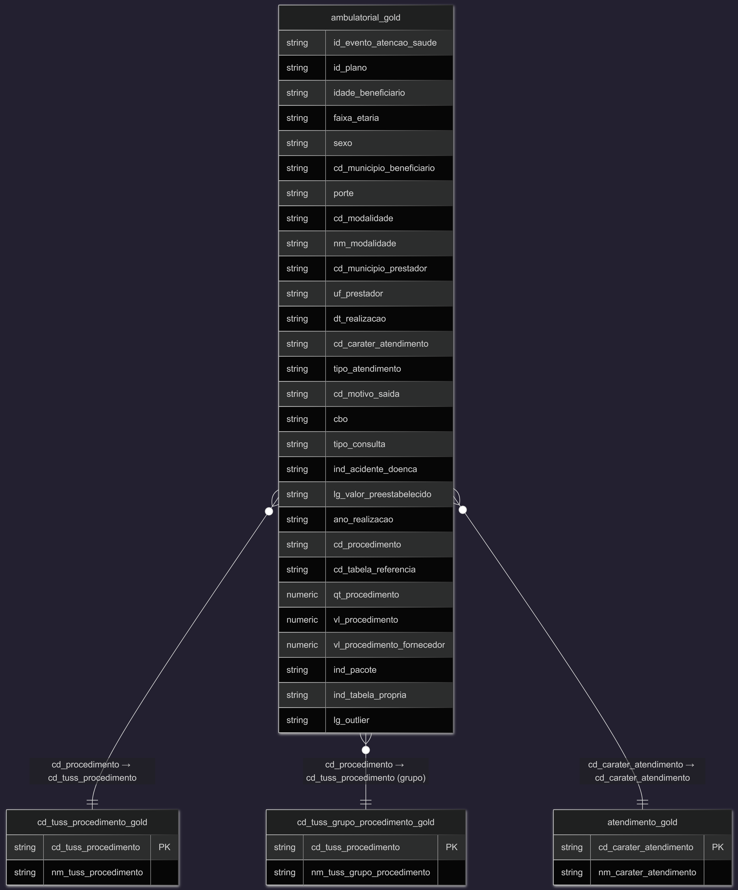
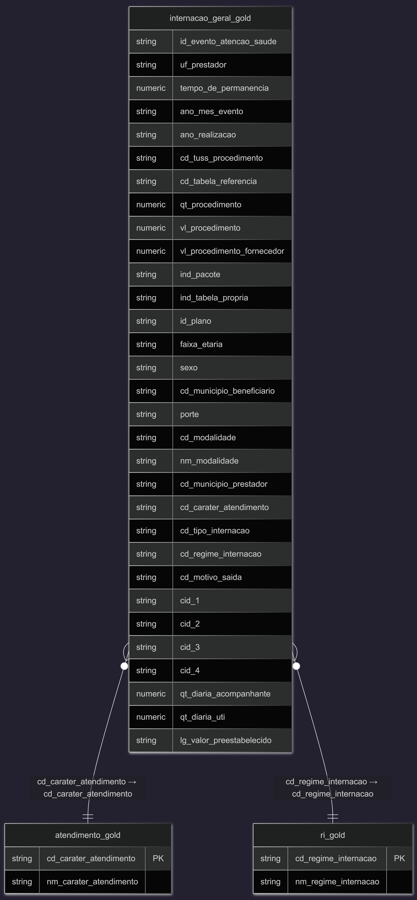

# MVP Engenharia de Dados

# 1️⃣ Objetivo
___

### 1.1 Descrição do MVP ###

Este MVP tem como objetivo desenvolver um pipeline de dados em nuvem para analisar a evolução do custo médio dos atendimentos ambulatoriais (relativos a determinados procedimentos) e do custo médio das internações (total e por regime de internação), conforme registros do padrão TISS – Troca de Informações em Saúde Suplementar, no período de 2015 a 2024.
Na etapa inicial de extração e implementação, foram utilizadas ferramentas como Jupyter-Python e SQL Postgres para coleta e organização dos dados. Em seguida, o processo foi refinado com tecnologias em nuvem, empregando Databricks e Delta Lake, abrangendo desde a ingestão até a disponibilização de dados prontos para análise.
O resultado esperado é uma base estruturada e confiável que permita identificar tendências, variações e fatores determinantes nos custos de saúde suplementar ao longo do período estudado.

### 1.2 Problema central ###

Atualmente, não há uma visão integrada e de fácil acesso sobre os custos de internação e atendimento ambulatorial no Brasil. Essa ausência dificulta a identificação de tendências, anomalias e dos principais fatores que influenciam a gestão da saúde suplementar.
Este MVP tem como propósito suprir essa necessidade, disponibilizando uma base de dados confiável e estruturada, capaz de sustentar análises tanto operacionais quanto estratégicas, e apoiar a tomada de decisões mais informadas no setor.

### 1.3 Escopo e etapas do pipeline ###

- Busca, extração dos arquivos TISS, cruzamento das bases consolidadas e detalhadas para montagem única das tabelas  mensais/anuais e seleção dos procedimentos dos atendimentos ambulatoriais e a base total de internação para o período 2015–2024 será realizada pelo SQL Postgres (criação da camada bronze parte 1).
- Ingestão e armazenamento: carregamento em Delta Lake para garantir governança, versionamento e performance.
- Modelagem: padronização, limpeza e harmonização dos dados (identificadores, datas, valores, procedimentos).
- Carga e transformação: criação de camadas (bronze parte 2, silver, gold) para suportar diferentes níveis de consumo.
- Análise e visualização: geração de métricas, dashboards e relatórios para identificar padrões de gasto, outliers e drivers de custo.

### 1.4 Perguntas que o projeto pretende responder ###

- Quais são as tendências temporais de custo médio por tipo de atendimento ambulatorial (por alguns procedimentos) e Internação (total de internação e regime de internação)?

### 1.5 Entregáveis esperados ###

- Base de dados consolidada em Delta Lake cobrindo 2015 – 2024.
- Conjunto de pipelines automatizados para ingestão, transformação e atualização dos dados.
- Dashboards e relatórios analíticos com indicadores-chave e insights acionáveis.
- Documentação técnica e guia de uso para replicação e manutenção.
Ao final do projeto, espera-se dispor de uma plataforma confiável que permita à gestão pública e a analistas compreender melhor os determinantes dos custos em saúde no Brasil e apoiar decisões baseadas em dados.

# 2️⃣ Fonte dos Dados e Coleta
___

Os dados utilizados neste projeto foram obtidos exclusivamente de fontes oficiais e públicas, portanto não há restrições de confidencialidade. A base principal é a troca de Informações em Saúde Suplementar (TISS), que reúne registros detalhados sobre atendimentos ambulatoriais e internações em todo o Brasil. O conjunto de dados abrange o período de 2015 a 2024 e inclui informações relevantes para análise de custos, procedimentos, prestadores e características demográficas dos atendimentos.

### 2.1 Download dos dados e estrutura desses dados

Os microdados foram baixados no site da ANS, no seguinte endereço abaixo:
Fonte: Troca de Informações em Saúde Suplementar (TISS) — https://dadosabertos.ans.gov.br/FTP/PDA/TISS/.

Os arquivos foram baixados manualmente, mês a mês, no formato ZIP, e extraídos para o formato CSV. 
As informações relativas aos atendimentos assistenciais na Saúde Suplementar são recebidas através do Padrão TISS e disponibilizadas pela ANS no Portal de Dados Abertos (PDA), por meio dos seguintes conjuntos de dados:

- Procedimentos Hospitalares por UF 
- Procedimentos Ambulatoriais por UF 
- Modelo de Remuneração por UF 
- Terminologia Unificada da Saúde Suplementar (TUSS) 

Os dados são apresentados em formato csv e estão separados por ano e UF. Há, ainda, uma planilha com as características dos produtos (planos de saúde) referentes aos eventos assistenciais realizados (consultas, exames, internações). As planilhas apresentam os dados consolidados, contendo as informações gerais de cada evento e os dados detalhados, que se referem aos itens assistenciais/procedimentos realizados em cada evento. Assim, para que as duas informações sejam cruzadas deve-se utilizar como chave o ID_EVENTO_ATENCAO_SAUDE. 

Os itens assistenciais/procedimentos disponibilizados de forma individualizada nos conjuntos de dados Procedimentos Hospitalares por UF e Procedimentos Ambulatoriais por UF estão relacionados nas terminologias de OPME e Materiais Especiais, Medicamentos e  Procedimentos e Eventos em Saúde (tabelas 19, 20 e 22 da TUSS, respectivamente). Os grupos dos itens assistenciais/procedimentos disponibilizados de forma agrupada nos conjuntos de dados estão relacionados na tabela 63 da TUSS (Grupos de procedimentos e itens assistenciais para envio para ANS). Para verificar se um código dessas terminologias está disponível de forma individualizada ou agrupada, deve-se consultar a tabela 64  (Forma de envio de procedimentos e itens assistenciais para ANS) da TUSS.

Os dados detalhados, referentes aos itens assistenciais/procedimentos, quando realizados através de um pacote de procedimentos (LG_PACOTE = 1) trarão uma linha com o código do pacote, que é criado pela operadora, com as quantidades e valores. As demais linhas trarão os itens assistenciais/procedimentos que compõem o pacote e sejam de envio individualizado para a ANS, com a tabela de referência e o código do item assistencial/procedimento de acordo com as tabelas TUSS, mas sem a informação sobre quantidades e valores.

Os códigos de diagnóstico do conjunto Procedimentos Hospitalares por UF (Hospitalar_CONS) são de envio opcional para a ANS, por determinação judicial. Ou seja, nem todos os eventos hospitalares possuem dados de diagnósticos associados.

### 2.2 Tabela Fato – Internação e Atendimento Ambulatorial 

As tabelas fato do projeto — `internacao_geral_gold` e `ambulatorial_geral_gold` — foram geradas a partir dos arquivos de internação e de atendimento ambulatorial disponibilizados no portal de dados abertos da ANS, sendo a fonte de informação descrita no item 1.1. 

### 2.3 Tabelas Dimensão

As tabelas dimensão foram obtidas no portal da ANS, e criados manualmente. Foram criadas no formato CSV, separadas por ";", utilizando um editor de texto. Essas tabelas foram baseadas diretamente nas informações contidas na tabela fato `internacao_geral_gold` e `ambulatorial_geral_gold` e incluem:

#### 2.3.1 Tabela dimensão `ambulatorial_geral_gold`

- PORTE  - `porte_gold` (Classificação da operadora, conforme quantidade de beneficiários com vínculo ativo no mês mais recente disponível no SIB)

- CD_PROCEDIMENTO `cd_tuss_procedimento_gold` (Alguns procedimentos selecionados para o cálculo da contas Sha referentes aos Código de procedimento/item assistencial, conforme tabelas TUSS 19, 20 ou 22).

- CD_PROCEDIMENTO `cd_grupo_tuss_procedimento_gold` (Alguns grupos de procedimentos selecionados para o cálculo da contas Sha referentes aos Código de procedimento/item assistencial, dos grupos de procedimentos, conforme tabela TUSS 63).

- CD_CARATER_ATENDIMENTO - `atendimento_gold` (Identificação do caráter do atendimento preenchida conforme a tabela TUSS 23 Terminologia de Caráter do atendimento)

#### 2.3.2 Tabela dimensão `internacao_geral_gold`

- PORTE  - `porte_gold` (Classificação da operadora, conforme quantidade de beneficiários com vínculo ativo no mês mais recente disponível no SIB)

- CD_CARATER_ATENDIMENTO -  `carater_atendimento_gold` (Identificação do caráter do atendimento preenchida conforme a tabela TUSS 23 - Terminologia de caráter do atendimento)

- CD_REGIME_INTERNACAO - `ri_gold` (Identificação do regime de internação preenchida conforme a tabela TUSS 41 - Terminologia de Regime de internação)

# 3️⃣ Modelagem e Catálogo de Dados
___

Para estruturar e organizar os dados de forma eficiente, foi adotado o Esquema Estrela, um dos modelos mais utilizados em Data Warehousing e Business Intelligence.

### 3.1 Estrutura do Esquema Estrela

##### 3.1.1 Estrutura do Esquema Estrela (Ambulatorial)
O esquema estrela do projeto foi construído com uma tabela fato principal contendo os registros de atendimento ambulatorial em saúde suplementar e 5 tabelas dimensão para compor as análises. A estrutura ficou organizada da seguinte forma:

 📊 Tabela Fato: `ambulatorial_geral_gold`
  
  - Esta tabela contém os registros de atendimento ambulatorial nos planos de saúde suplementar e é o núcleo central do esquema. Cada linha representa um atendimento ambulatorial registrado.

  📊 Tabelas Dimensão:  `porte_gold`, `cd_tuss_procedimento_gold`,`cd_grupo_tuss_procedimento_gold`,`atendimento_gold`

  - Foram criadas tabelas auxiliares para armazenar descrições de variáveis categóricas e facilitar a análise por meio de junções (joins) entre as tabelas.

##### 3.1.2 Estrutura do Esquema Estrela (Internação)
O esquema estrela do projeto foi construído com uma tabela fato principal contendo os registros das internações em saúde suplementar e 4 tabelas dimensão para compor as análises. A estrutura ficou organizada da seguinte forma:

 📊 Tabela Fato: `internacao_geral_gold`
  
  - Esta tabela contém os registros de internações nos planos de saúde suplementar e é o núcleo central do esquema. Cada linha representa uma internação registrada.

  📊 Tabelas Dimensão: `porte_gold`,`carater_atendimento_gold`,`ri_gold`

  - Foram criadas tabelas auxiliares para armazenar descrições de variáveis categóricas e facilitar a análise por meio de junções (joins) entre as tabelas.

### 3.2 Catálogo de Dados

##### 3.2.1 Tabela `ambulatorial_geral_gold`

A tabela fato `ambulatorial_geral_gold` referente aos informações dos atendimentos ambulatoriais dos planos em saúde suplementar, foram criadas a partir da base original do TISS, onde a base contém tabelas:

Ambulatorial_CONS (microdados consolidados que contém 20 colunas).
- São dados agregados, já somados por operadora, município, faixa etária, sexo, procedimento etc.
- Não existe linha por atendimento individual.
- Análise macro: quantidade de procedimentos, quantidade de beneficiários atendidos, valores pagos (total), valores cobrados
- análise micro: (evolução do gasto total, comparação entre regiões, variações por tipo de procedimento)
- Abaixo a descrição dos microdados:

| Nome da Coluna              | Tipo          | Tamanho | Descrição                                                                                                                                                                                                                                                                     | Observações |
|-----------------------------|---------------|---------|---------------------------------------------------------------------------------------------------------------------------------------------------------------------------------------------------------------------------------------------------------------------------------|-------------|
| ID_EVENTO_ATENCAO_SAUDE     | NUMBER        | 30      | Identificador único do evento. Um evento ambulatorial ocorre quando o procedimento foi solicitado via guia de consulta ou SP/SADT, desde que não esteja vinculado a internação. Eventos de consulta possuem uma única guia; eventos SP/SADT podem ter várias guias vinculadas. |             |
| ID_PLANO                    | NUMBER        | 10      | Identificador único do plano.                                                                                                                                                                                                                                                  | Número criado apenas para divulgação; não corresponde a identificadores oficiais da ANS. |
| FAIXA_ETARIA                | VARCHAR(15)   | 15      | Faixa etária do beneficiário.                                                                                                                                                                                                                                                  | “Não identificado” indica ausência de correspondência no SIB ou CNS. Faixas: <1; 1–4; 5–9; 10–14; 15–19; 20–29; 30–39; 40–49; 50–59; 60–69; 70–79; 80+. |
| SEXO                        | VARCHAR2(10)  | 2       | Sexo do beneficiário conforme tabela TUSS 43.                                                                                                                                                                                                                                  | Vazio = não identificado após cruzamento com SIB/CNS. |
| CD_MUNICIPIO_BENEFICIARIO   | VARCHAR2(6)   | 6       | Código IBGE do município de residência do beneficiário.                                                                                                                                                                                                                        | Vazio = não identificado após cruzamento com SIB/CNS. |
| PORTE                       | VARCHAR2(20)  | 20      | Classificação da operadora conforme número de beneficiários ativos.                                                                                                                                                                                                            | GRANDE (≥100 mil), MÉDIO (20 mil–99.999), PEQUENO (<20 mil), SEM BENEFICIÁRIOS. |
| CD_MODALIDADE               | NUMBER        | 2       | Identificação da modalidade da operadora.                                                                                                                                                                                                                                      | 21/55 Administradora; 22 Coop. Médica; 23 Coop. Odonto; 24 Autogestão; 25 Med. Grupo; 26 Odonto Grupo; 27 Filantropia; 28/29 Seguradora Especializada. |
| NM_MODALIDADE               | VARCHAR2(40)  | 40      | Classificação jurídica da operadora.                                                                                                                                                                                                                                           | Administradora; Cooperativa Médica; Cooperativa Odontológica; Autogestão; Medicina de Grupo; Odontologia de Grupo; Filantropia; Seguradora Especializada. |
| CD_MUNICIPIO_PRESTADOR      | VARCHAR2(6)   | 6       | Código IBGE do município do prestador executante.                                                                                                                                                                                                                              |             |
| UF_PRESTADOR                | VARCHAR2(2)   | 2       | Unidade Federativa do prestador.                                                                                                                                                                                                                                               |             |
| DT_REALIZACAO               | DATE          | 6       | Ano e mês da ocorrência do evento no formato `yyyy-mm`.                                                                                                                                                                                                                        |             |
| CD_CARATER_ATENDIMENTO      | VARCHAR2(40)  | 40      | Caráter do atendimento conforme tabela TUSS 23.                                                                                                                                                                                                                                | 1 = Eletivo; 2 = Urgência/Emergência; vazio = sem informação. |
| TIPO_ATENDIMENTO            | VARCHAR2(40)  | 40      | Tipo de atendimento conforme tabela TUSS 50.                                                                                                                                                                                                                                   |             |
| REGIME_ATENDIMENTO          | VARCHAR2(40)  | 40      | Regime de atendimento conforme tabela TUSS 76.                                                                                                                                                                                                                                 |             |
| CD_MOTIVO_SAIDA             | VARCHAR2(40)  | 40      | Motivo de encerramento conforme tabela TUSS 39.                                                                                                                                                                                                                                |             |
| CBO                         | VARCHAR2(40)  | 40      | Código Brasileiro de Ocupação conforme tabela TUSS 24.                                                                                                                                                                                                                         |             |
| TIPO_CONSULTA               | VARCHAR2(40)  | 40      | Tipo de consulta conforme tabela TUSS 52.                                                                                                                                                                                                                                      |             |
| SAUDE_OCUPACIONAL           | VARCHAR2(40)  | 40      | Identificação de saúde ocupacional conforme tabela TUSS 77.                                                                                                                                                                                                                    |             |
| IND_ACIDENTE_DOENCA         | NUMBER        | 1       | Indica se o atendimento ocorreu devido a acidente ou doença relacionada, conforme tabela TUSS 36.                                                                                                                                                                              | 0 = Não; 1 = Sim. |
| LG_VALOR_PREESTABELECIDO    | NUMBER        | 2       | Indica se a remuneração envolve contrato por valor preestabelecido, independente da realização dos serviços.                                                                                                                                                                   | 0 = Não; 1 = Sim. |

Ambulatorial_DET (microdados consolidados que contém 11 colunas) 
-  São registros linha a linha, cada linha representando um atendimento/procedimento.
- Análise macro: código do procedimento TUSS, data do atendimento, tipo de prestador, regime de atendimento,valores cobrados e pagos por item.
- análise micro: distribuição de custos por prestador, identificação de outliers, análise de frequência por procedimento,estudos de comportamento individual dos atendimentos
- Abaixo a descrição dos microdados:

| Nome da Coluna              | Tipo          | Tamanho | Descrição                                                                                                                                                                                                                                                                     | Observações |
|-----------------------------|---------------|---------|---------------------------------------------------------------------------------------------------------------------------------------------------------------------------------------------------------------------------------------------------------------------------------|-------------|
| ID_EVENTO_ATENCAO_SAUDE     | NUMBER        | 30      | Identificador único do evento. Um evento ambulatorial ocorre quando o procedimento executado foi solicitado através de uma guia de consulta ou de SP/SADT, desde que não esteja vinculada a um evento de internação. Eventos de consulta possuem apenas uma guia; eventos SP/SADT podem ter várias guias. |             |
| UF_PRESTADOR                | VARCHAR2(2)   | 2       | Unidade Federativa do prestador.                                                                                                                                                                                                                                               |             |
| DT_REALIZACAO               | DATE          | 6       | Ano e mês da ocorrência do evento, no formato `yyyy-mm`.                                                                                                                                                                                                                       |             |
| CD_PROCEDIMENTO             | VARCHAR2(40)  | 40      | Código do procedimento/item assistencial conforme tabelas TUSS 19, 20, 22 ou grupos de procedimentos (tabela TUSS 63). Códigos das tabelas 90 e 98 referem-se a pacotes criados pelas operadoras.                                                                               |             |
| CD_TABELA_REFERENCIA        | VARCHAR2(40)  | 40      | Código da tabela TUSS utilizada.                                                                                                                                                                                                                                               |             |
| QT_ITEM_EVENTO_INFORMADO    | NUMBER        | 6       | Quantidade do procedimento/item assistencial individualizado ou grupo de procedimentos (TUSS 63), informada pelo prestador executante.                                                                                                                                          |             |
| VL_ITEM_EVENTO_INFORMADO    | NUMBER(18,2)  | 18,2    | Valor informado dos procedimentos/itens assistenciais individualizados ou do grupo de procedimentos. Corresponde à soma dos valores informados em cada guia que compõe o evento.                                                                                                |             |
| VL_ITEM_PAGO_FORNECEDOR     | NUMBER(18,2)  | 18,2    | Valor total pago pela operadora diretamente aos fornecedores.                                                                                                                                                                                                                  |             |
| UNIDADE_MEDIDA              | VARCHAR2(40)  | 40      | Código da unidade de medida conforme tabela TUSS 60 (Terminologia de Unidade de Medida).                                                                                                                                                                                       |             |
| IND_PACOTE                  | NUMBER        | 2       | Indica se o procedimento/item assistencial faz parte de um pacote. **0 = Não**, **1 = Sim**.                                                                                                                                                                                   |             |
| IND_TABELA_PROPRIA          | NUMBER        | 1       | Indica se o código utilizado foi criado pela própria operadora (não possui código TUSS). **0 = Não**, **1 = Sim**.                                                                                                                                                             |             |

Durante o processo de ETL, esses microdados foram juntados através do merge e formou-se uma tabela somente com todas essas colunas, resultando em 28 colunas.
Abaixo a descrição das tabelas:

| Nome da Coluna               | #  | Tipo de Dados     | Identidade | Collation | Não Nulo | Padrão  | Comentário |
|------------------------------|----|--------------------|------------|-----------|----------|---------|------------|
| id_evento_atencao_saude      | 1  | varchar(32767)     | NULL       | default   | false    | NULL    | NULL       |
| id_plano                     | 2  | varchar(32767)     | NULL       | default   | false    | NULL    | NULL       |
| idade_beneficiario           | 3  | varchar(32767)     | NULL       | default   | false    | NULL    | NULL       |
| faixa_etaria                 | 4  | varchar(32767)     | NULL       | default   | false    | NULL    | NULL       |
| sexo                         | 5  | varchar(32767)     | NULL       | default   | false    | NULL    | NULL       |
| cd_municipio_beneficiario    | 6  | varchar(32767)     | NULL       | default   | false    | NULL    | NULL       |
| porte                        | 7  | varchar(32767)     | NULL       | default   | false    | NULL    | NULL       |
| cd_modalidade                | 8  | varchar(32767)     | NULL       | default   | false    | NULL    | NULL       |
| nm_modalidade                | 9  | varchar(32767)     | NULL       | default   | false    | NULL    | NULL       |
| cd_municipio_prestador       | 10 | varchar(32767)     | NULL       | default   | false    | NULL    | NULL       |
| uf_prestador                 | 11 | varchar(32767)     | NULL       | default   | false    | NULL    | NULL       |
| dt_realizacao                | 12 | varchar(32767)     | NULL       | default   | false    | NULL    | NULL       |
| cd_carater_atendimento       | 13 | varchar(32767)     | NULL       | default   | false    | NULL    | NULL       |
| tipo_atendimento             | 14 | varchar(32767)     | NULL       | default   | false    | NULL    | NULL       |
| cd_motivo_saida              | 15 | varchar(32767)     | NULL       | default   | false    | NULL    | NULL       |
| cbo                          | 16 | varchar(32767)     | NULL       | default   | false    | NULL    | NULL       |
| tipo_consulta                | 17 | varchar(32767)     | NULL       | default   | false    | NULL    | NULL       |
| ind_acidente_doenca          | 18 | varchar(32767)     | NULL       | default   | false    | NULL    | NULL       |
| lg_valor_preestabelecido     | 19 | varchar(32767)     | NULL       | default   | false    | NULL    | NULL       |
| ano_realizacao               | 20 | text               | NULL       | default   | false    | NULL    | NULL       |
| cd_procedimento              | 21 | varchar(32767)     | NULL       | default   | false    | NULL    | NULL       |
| cd_tabela_referencia         | 22 | varchar(32767)     | NULL       | default   | false    | NULL    | NULL       |
| qt_procedimento              | 23 | numeric            | NULL       | NULL      | false    | NULL    | NULL       |
| vl_procedimento              | 24 | numeric            | NULL       | NULL      | false    | NULL    | NULL       |
| vl_procedimento_fornecedor   | 25 | numeric            | NULL       | NULL      | false    | NULL    | NULL       |
| ind_pacote                   | 26 | varchar(32767)     | NULL       | default   | false    | NULL    | NULL       |
| ind_tabela_propria           | 27 | varchar(32767)     | NULL       | default   | false    | NULL    | NULL       |
| lg_outlier                   | 28 | varchar(32767)     | NULL       | default   | false    | NULL    | NULL       |

##### 3.2.2 Tabela `internacao_geral_gold`

A tabela fato `internacao_geral_gold` referente aos informações das internações dos planos em saúde suplementar, foram criadas a partir da base original do TISS, onde a base contém tabelas:

Hospitalar_CONS (microdados consolidados que contém 24 colunas).
- São dados agregados, já somados pela operadora, por mês, por tipo de internação, por procedimento ou por características do beneficiário.
- Características: Não há uma linha por internação, não há detalhes de cada guia hospitalar, os valores e quantidades já vêm somados.
- Permite análises macro, como: custo médio de internação por ano, total de internações por tipo de regime, evolução do gasto hospitalar
- comparações entre regiões ou operadoras.
Abaixo a descrição das tabelas:

| Nome da Coluna             | Tipo         | Tamanho | Descrição                                                                                                                                                                                                                                                                 | Observações |
|----------------------------|--------------|---------|-----------------------------------------------------------------------------------------------------------------------------------------------------------------------------------------------------------------------------------------------------------------------------|-------------|
| ID_EVENTO_ATENCAO_SAUDE    | NUMBER       | 30      | Identificador único do evento. Um evento de internação ocorre quando existe(m) Guia(s) de Resumo de Internação. Pode incluir Guias de Resumo de Internação, Guias de Honorários e Guias de SP/SADT. A união entre as guias é feita pelo número de solicitação de internação. |             |
| ID_PLANO                   | NUMBER       | 10      | Identificador único do plano.                                                                                                                                                                                                                                              | Número criado apenas para divulgação; não corresponde a identificadores oficiais da ANS. |
| FAIXA_ETARIA               | VARCHAR(15)  | 15      | Faixa etária do beneficiário.                                                                                                                                                                                                                                              | “Não identificado” = idade não encontrada no SIB/CNS. Faixas: <1; 1–4; 5–9; 10–14; 15–19; 20–29; 30–39; 40–49; 50–59; 60–69; 70–79; 80+. |
| SEXO                       | VARCHAR2(10) | 10      | Sexo do beneficiário conforme tabela TUSS 43.                                                                                                                                                                                                                              | Vazio = sexo não identificado após cruzamento com SIB/CNS. |
| CD_MUNICIPIO_BENEFICIARIO  | VARCHAR2(6)  | 6       | Código IBGE do município de residência do beneficiário.                                                                                                                                                                                                                    | Vazio = município não identificado após cruzamento com SIB/CNS. |
| PORTE                      | VARCHAR2(20) | 20      | Classificação da operadora conforme número de beneficiários ativos.                                                                                                                                                                                                        | GRANDE (≥100 mil), MÉDIO (20 mil–99.999), PEQUENO (<20 mil), SEM BENEFICIÁRIOS. |
| CD_MODALIDADE              | NUMBER       | 210     | Identificação da modalidade da operadora.                                                                                                                                                                                                                                  | 21/55 Administradora; 22 Coop. Médica; 23 Coop. Odonto; 24 Autogestão; 25 Med. Grupo; 26 Odonto Grupo; 27 Filantropia; 28/29 Seguradora Especializada. |
| NM_MODALIDADE              | VARCHAR2(40) | 40      | Classificação jurídica da operadora.                                                                                                                                                                                                                                       | Administradora; Cooperativa Médica; Cooperativa Odontológica; Autogestão; Medicina de Grupo; Odontologia de Grupo; Filantropia; Seguradora Especializada. |
| CD_MUNICIPIO_PRESTADOR     | VARCHAR2(6)  | 6       | Código IBGE do município do prestador executante.                                                                                                                                                                                                                          | Omitido quando há apenas um prestador hospitalar no município durante o ano. |
| UF_PRESTADOR               | VARCHAR2(2)  | 2       | Unidade Federativa do prestador executante.                                                                                                                                                                                                                                |             |
| TEMPO_DE_PERMANENCIA       | NUMBER       | 3       | Tempo, em dias, entre a data de saída e a data de entrada da internação.                                                                                                                                                                                                   | -1 = não calculado; 1 dia quando entrada e saída ocorrem na mesma data. |
| ANO_MES_EVENTO             | DATE         | 6       | Ano e mês da ocorrência do evento, no formato `yyyy-mm`.                                                                                                                                                                                                                   |             |
| CD_CARATER_ATENDIMENTO     | VARCHAR(40)  | 40      | Caráter do atendimento conforme tabela TUSS 23.                                                                                                                                                                                                                            | 1 = Eletivo; 2 = Urgência/Emergência; vazio = sem informação. |
| CD_TIPO_INTERNACAO         | VARCHAR(40)  | 40      | Tipo de internação conforme tabela TUSS 57.                                                                                                                                                                                                                                |             |
| CD_REGIME_INTERNACAO       | VARCHAR(40)  | 40      | Regime de internação conforme tabela TUSS 41.                                                                                                                                                                                                                              |             |
| CD_MOTIVO_SAIDA            | VARCHAR(40)  | 40      | Motivo de encerramento conforme tabela TUSS 39.                                                                                                                                                                                                                            |             |
| CID_1                      | VARCHAR(6)   | 6       | Código CID-10 do primeiro diagnóstico.                                                                                                                                                                                                                                     |             |
| CID_2                      | VARCHAR(6)   | 6       | Código CID-10 do segundo diagnóstico (se houver).                                                                                                                                                                                                                          |             |
| CID_3                      | VARCHAR(6)   | 6       | Código CID-10 do terceiro diagnóstico (se houver).                                                                                                                                                                                                                         |             |
| CID_4                      | VARCHAR(6)   | 6       | Código CID-10 do quarto diagnóstico (se houver).                                                                                                                                                                                                                           |             |
| QT_DIARIA_ACOMPANHANTE     | NUMBER       | —       | Número de diárias de acompanhante.                                                                                                                                                                                                                                         |             |
| QT_DIARIA_UTI              | NUMBER       | —       | Número de diárias de UTI.                                                                                                                                                                                                                                                  |             |
| IND_ACIDENTE_DOENCA        | VARCHAR      | 1       | Indica se o atendimento ocorreu devido a acidente ou doença relacionada, conforme tabela TUSS 36.                                                                                                                                                                          | 0 = Não; 1 = Sim |
| LG_VALOR_PREESTABELECIDO   | NUMBER       | 2       | Indica se a remuneração envolve contrato por valor preestabelecido, independente da realização dos serviços.                                                                                                                                                               | 0 = Não; 1 = Sim |

Hospitalar_DET (microdados detalhados que contém 12 colunas).
- São dados linha a linha, onde cada registro representa uma internação ou um item da internação (dependendo da versão do arquivo).
- Características: Contém informações detalhadas da internação: data de entrada e saída, regime de internação (clínica, cirúrgica, obstétrica etc.), caráter do atendimento (eletivo, urgência), motivo de saída (alta, óbito, transferência), CBO do profissional, procedimento principal, valores cobrados e pagos.
- Permite análises micro, como: identificação de outliers de custo, análise de permanência hospitalar, comparação entre prestadores, estudo de padrões de internação por diagnóstico ou procedimento.
- Abaixo a descrição das tabelas:

| Nome da Coluna            | Tipo         | Tamanho | Descrição                                                                                                                                                                                                                                                                 | Observações |
|---------------------------|--------------|---------|-----------------------------------------------------------------------------------------------------------------------------------------------------------------------------------------------------------------------------------------------------------------------------|-------------|
| ID_EVENTO_ATENCAO_SAUDE   | NUMBER       | 30      | Identificador único do evento. Um evento de internação ocorre quando existe(m) Guia(s) de Resumo de Internação. Pode incluir uma ou mais Guias de Resumo de Internação, Guias de Honorários e Guias de SP/SADT. A união entre as guias é feita pelo número de solicitação. |             |
| UF_PRESTADOR              | VARCHAR2(2)  | 2       | Unidade federativa do prestador executante.                                                                                                                                                                                                                                |             |
| TEMPO_DE_PERMANENCIA      | NUMBER       | 3       | Tempo, em dias, entre a data de saída e a data de entrada da internação.                                                                                                                                                                                                   | -1 = não calculado; 1 dia quando entrada e saída ocorrem na mesma data. |
| ANO_MES_EVENTO            | DATE         | 6       | Ano e mês da ocorrência do evento, no formato `yyyy-mm`.                                                                                                                                                                                                                   |             |
| CD_PROCEDIMENTO           | VARCHAR2(40) | 40      | Código do procedimento/item assistencial conforme tabelas TUSS 19, 20, 22 ou grupos (TUSS 63).                                                                                                                                                                             | Tabelas 90 e 98 = pacotes criados pelas operadoras. |
| CD_TABELA_REFERENCIA      | VARCHAR2(40) | 40      | Código da tabela TUSS utilizada.                                                                                                                                                                                                                                           |             |
| QT_ITEM_EVENTO_INFORMADO  | NUMBER       | 6       | Quantidade do procedimento/item assistencial individualizado ou grupo (TUSS 63), informada pelo prestador executante.                                                                                                                                                      |             |
| VL_ITEM_EVENTO_INFORMADO  | NUMBER(18,2) | 18,2    | Valor informado dos procedimentos/itens assistenciais. Corresponde à soma dos valores informados em cada guia que compõe o evento.                                                                                                                                         |             |
| VL_ITEM_PAGO_FORNECEDOR   | NUMBER(18,2) | 18,2    | Valor total pago pela operadora diretamente aos fornecedores.                                                                                                                                                                                                              |             |
| UNIDADE_MEDIDA            | VARCHAR2(40) | 40      | Código da unidade de medida conforme tabela TUSS 60 (Terminologia de Unidade de Medida).                                                                                                                                                                                   |             |
| IND_PACOTE                | NUMBER       | 2       | Indica se o procedimento/item assistencial faz parte de um pacote.                                                                                                                                                                                                         | 0 = Não; 1 = Sim |
| IND_TABELA_PROPRIA        | NUMBER       | 1       | Indica se o código utilizado foi criado pela própria operadora (não possui código TUSS).                                                                                                                                                                                   | 0 = Não; 1 = Sim |

Durante o processo de ETL, esses microdados foram juntados através do merge e formou-se uma tabela somente com todas essas colunas, resultando em 31 colunas.
Abaixo a descrição das tabelas:

| Nome da Coluna               | #  | Tipo de Dados     | Identidade | Collation | Não Nulo | Padrão | Comentário |
|------------------------------|----|--------------------|------------|-----------|----------|--------|------------|
| id_evento_atencao_saude      | 1  | varchar(32767)     | NULL       | default   | false    | NULL   | NULL       |
| uf_prestador                 | 2  | varchar(32767)     | NULL       | default   | false    | NULL   | NULL       |
| tempo_de_permanencia         | 3  | varchar(32767)     | NULL       | default   | false    | NULL   | NULL       |
| ano_mes_evento               | 4  | varchar(32767)     | NULL       | default   | false    | NULL   | NULL       |
| ano_realizacao               | 5  | text               | NULL       | default   | false    | NULL   | NULL       |
| cd_tuss_procedimento         | 6  | varchar(32767)     | NULL       | default   | false    | NULL   | NULL       |
| cd_tabela_referencia         | 7  | varchar(32767)     | NULL       | default   | false    | NULL   | NULL       |
| qt_procedimento              | 8  | numeric            | NULL       | NULL      | false    | NULL   | NULL       |
| vl_procedimento              | 9  | numeric            | NULL       | NULL      | false    | NULL   | NULL       |
| vl_procedimento_fornecedor   | 10 | numeric            | NULL       | NULL      | false    | NULL   | NULL       |
| ind_pacote                   | 11 | varchar(32767)     | NULL       | default   | false    | NULL   | NULL       |
| ind_tabela_propria           | 12 | varchar(32767)     | NULL       | default   | false    | NULL   | NULL       |
| id_plano                     | 13 | varchar(32767)     | NULL       | default   | false    | NULL   | NULL       |
| faixa_etaria                 | 14 | varchar(32767)     | NULL       | default   | false    | NULL   | NULL       |
| sexo                         | 15 | varchar(32767)     | NULL       | default   | false    | NULL   | NULL       |
| cd_municipio_beneficiario    | 16 | varchar(32767)     | NULL       | default   | false    | NULL   | NULL       |
| porte                        | 17 | varchar(32767)     | NULL       | default   | false    | NULL   | NULL       |
| cd_modalidade                | 18 | varchar(32767)     | NULL       | default   | false    | NULL   | NULL       |
| nm_modalidade                | 19 | varchar(32767)     | NULL       | default   | false    | NULL   | NULL       |
| cd_municipio_prestador       | 20 | varchar(32767)     | NULL       | default   | false    | NULL   | NULL       |
| cd_carater_atendimento       | 21 | varchar(32767)     | NULL       | default   | false    | NULL   | NULL       |
| cd_tipo_internacao           | 22 | varchar(32767)     | NULL       | default   | false    | NULL   | NULL       |
| cd_regime_internacao         | 23 | varchar(32767)     | NULL       | default   | false    | NULL   | NULL       |
| cd_motivo_saida              | 24 | varchar(32767)     | NULL       | default   | false    | NULL   | NULL       |
| cid_1                        | 25 | varchar(32767)     | NULL       | default   | false    | NULL   | NULL       |
| cid_2                        | 26 | varchar(32767)     | NULL       | default   | false    | NULL   | NULL       |
| cid_3                        | 27 | varchar(32767)     | NULL       | default   | false    | NULL   | NULL       |
| cid_4                        | 28 | varchar(32767)     | NULL       | default   | false    | NULL   | NULL       |
| qt_diaria_acompanhante       | 29 | numeric            | NULL       | NULL      | false    | NULL   | NULL       |
| qt_diaria_uti                | 30 | numeric            | NULL       | NULL      | false    | NULL   | NULL       |
| lg_valor_preestabelecido     | 31 | varchar(32767)     | NULL       | default   | false    | NULL   | NULL       |

##### 3.2.3 Tabelas Auxiliares

##### Tabela: `cd_tuss_procedimento_gold`

Tabela auxiliar com a descrição de alguns procedimentos da TUSS selecionados para análise

| PK  | NOME DA COLUNA        | DESCRIÇÃO                           | DATATYPE | TAMANHO | VALORES POSSIVEIS                                   | RELACIONAMENTO                                                                 |
|-----|------------------------|--------------------------------------|----------|---------|------------------------------------------------------|---------------------------------------------------------------------------------|
| ✅  | cd_tuss_procedimento   | código dos procedimentos TUSS        | string   | 32767   | *os códigos estarão em uma tabela no anexo*          | ambulatorial_geral.cd_tuss_procedimento = cd_tuss_procedimento_gold.cd_tuss_procedimento |
|     | nm_tuss_procedimento  | descrição dos procedimentos TUSS     | string   | 32767   | *as descrições estarão em uma tabela no anexo*       | -                                                                               |

##### Tabela: `cd_grupo_tuss_procedimento_gold`

Tabela auxiliar com a descrição dos grupos de procedimentos da TUSS selecionados para análise

| PK  | NOME DA COLUNA              | DESCRIÇÃO                                   | DATATYPE | TAMANHO | VALORES POSSIVEIS                               | RELACIONAMENTO                                                                                  |
|-----|------------------------------|----------------------------------------------|----------|---------|--------------------------------------------------|--------------------------------------------------------------------------------------------------|
| ✅  | cd_tuss_procedimento         | código dos grupos de procedimentos TUSS      | string   | 32767   | *os códigos estarão em uma tabela no anexo*      | ambulatorial_geral.cd_tuss_procedimento = cd_tuss_grupo_procedimento_gold.cd_tuss_procedimento |
|     | nm_tuss_grupo_procedimento  | descrição dos grupos de procedimentos TUSS   | string   | 32767   | *as descrições estarão em uma tabela no anexo*   | -                                                                                                |

##### Tabela: `atendimento_gold`

Tabela auxilia na descrição do tipo de atendimento se é eletivo ou de emergência

| PK  | NOME DA COLUNA         | DESCRIÇÃO                                                                 | DATATYPE | TAMANHO | VALORES POSSIVEIS                                           | RELACIONAMENTO                                                                                              |
|-----|-------------------------|---------------------------------------------------------------------------|----------|---------|--------------------------------------------------------------|--------------------------------------------------------------------------------------------------------------|
| ✅  | cd_carater_atendimento  | Identificação do caráter do atendimento conforme a TUSS 23.              | string   | 40      | 1, 2, (Vazio)                                                | ambulatorial_geral.cd_carater_atendimento = atendimento_gold.cd_carater_atendimento internacao_geral.cd_carater_atendimento = atendimento_gold.cd_carater_atendimento |
|     | nm_carater_atendimento | Descrição do caráter do atendimento conforme a TUSS 23.                  | string   | 32767   | 1 - Eletivo; 2 - Urgência/Emergência; (Vazio) = Sem informação | -                                                                                                            |

##### Tabela: `ri_gold`

Tabela auxilia na descrição do tipo de internação

| PK  | NOME DA COLUNA         | DESCRIÇÃO                                                                 | DATATYPE | TAMANHO | VALORES POSSIVEIS                                           | RELACIONAMENTO                                                                                              |
|-----|-------------------------|---------------------------------------------------------------------------|----------|---------|--------------------------------------------------------------|--------------------------------------------------------------------------------------------------------------|
| ✅  | cd_carater_atendimento  | Identificação do caráter do atendimento conforme a TUSS 23.              | string   | 40      | 1, 2, (Vazio)                                                | ambulatorial_geral.cd_carater_atendimento = atendimento_gold.cd_carater_atendimento internacao_geral.cd_carater_atendimento = atendimento_gold.cd_carater_atendimento |
|     | nm_carater_atendimento | Descrição do caráter do atendimento conforme a TUSS 23.                  | string   | 32767   | 1 - Eletivo; 2 - Urgência/Emergência; (Vazio) = Sem informação | -                                                                                                            |

### 3.3 Diagrama Entidade Relacionamento

##### 3.3.1 Tabela `ambulatorial_geral_gold`

##### 3.3.2 Tabela `internacao_geral_gold`

# 4️⃣ Carga
___

Nesta etapa será feita a carga dos dados para o Delta Lake do Databricks. Será feito um pipeline de ETL (Extração, Transformação e Carga) e todos os processos realizados serão documentados.

Inicialmente, importaremos as bibliotecas necessárias e criaremos o banco de dados, organizando os dados em três camadas dentro da arquitetura medallion (Bronze, Silver e Gold). Cada camada terá um papel na preparação dos dados:

🥉 Camada Bronze: Armazena os dados brutos, exatamente como foram extraídos das fontes originais, sem qualquer modificação.
- Nesta etapa, como os microdados são gigantescos,foi feita em duas etapas: 

1. Camada Bronze parte 1: os microdados brutos em formato csv foram baixados e importados via python jupyther para SQL POSTGRES servidor local
2. Cama Bronze parte 2: As tabelas auxiliares serõ criada e importadas para o DATABRICKS. 

🥈 Camada Silver: 

1.  Os microdados brutos em formato csv foram baixados e importados via python jupyther para SQL POSTGRES servidor local, onde foi feita armazenagem, modificações em algumas variáveis como padronização, e por último o merge tanto da parte consolidada e da parte detalhada e criado a base final tanto para internação quanto para os atendimentos ambulatoriais e com a base final pronta, foi exportada de SQL POSTGRES servidor local para o formato CSV e importado para o Delta Lake do Databricks

2. Aplicada limpeza, padronização e enriquecimento dos dados, removendo inconsistências e garantindo a qualidade, e por último as tabelas, finais serão exportadas para o DATABRICKS.

🥇 Camada Gold: Otimiza as tabelas para consultas analíticas e geração de insights para consumo final.

